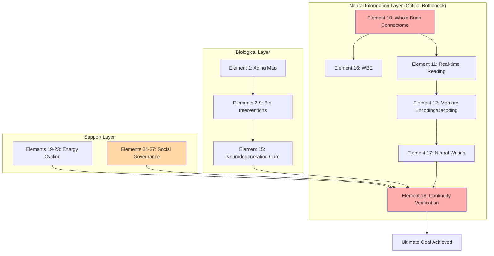

# Time Dimension Breakthrough: 27 Elements Technical Checklist

**Document Type**: Technical Specification
**Version**: 2.1
**Last Updated**: 2025-12-25
**Module**: Immortality Project · Time Dimension

---

## Abstract

This document systematically organizes the 27 key technical elements required to achieve Longevity Escape Velocity (LEV). Elements are categorized into four major categories by functional hierarchy: Biological Foundation (9 items), Neural Information Layer (9 items), Energy and Material Cycling (5 items), and Social Governance (4 items). This checklist aims to provide a systematic reference framework for research prioritization and resource allocation.

**Keywords**: Longevity Escape Velocity, Hallmarks of Aging, Whole Brain Emulation, Neural Encoding, Consciousness Continuity

---

## 1. Introduction

### 1.1 Theoretical Foundation

The realization of any complex goal is essentially the collection of all its necessary constituent elements. The task of this checklist is to identify, define, and track all technical elements required for indefinite life extension.

### 1.2 Operational Definition of Goals

| Goal Level | Definition | Acceptance Criteria |
|:---|:---|:---|
| **Ultimate Goal** | Infinite continuation of consciousness in the time dimension | System function maintained as t → ∞ |
| **Subjective Continuity** | Uninterrupted flow of individual subjective experience | Self-identity preserved |
| **Physical Continuity** | Continuous operation of consciousness-bearing system | Hardware/substrate maintainable or replaceable |
| **Verifiability** | External observers can confirm identity continuation | Objective test protocol passed |

---

## 2. Element Checklist

### 2.1 Part One: Biological Foundation (Elements 1-9)

#### Element 1: Complete Aging Mechanism Map

| Attribute | Value |
|:---|:---|
| **Completion** | 80% |
| **Description** | Clarify all Hallmarks of Aging and their causal relationship network |
| **Current Status** | López-Otín (2023) version identified 12 hallmarks; priorities and network relationships pending |
| **Action Items** | Establish multi-omics unified database, conduct large-scale longitudinal studies |
| **Key Literature** | López-Otín et al. (2023). *Cell*, 186(2), 243-278 |

#### Element 2: Telomere Maintenance Technology

| Attribute | Value |
|:---|:---|
| **Completion** | 60% |
| **Description** | Safely and controllably maintain telomere length without increasing cancer risk |
| **Technical Path** | Reversible telomerase activation switch + high-precision cancer monitoring system |
| **Risk** | Association between telomerase overactivation and tumorigenesis |

#### Element 3: Senescent Cell Clearance (Senolytics)

| Attribute | Value |
|:---|:---|
| **Completion** | 40% |
| **Description** | Efficiently and specifically clear senescent cells from the body |
| **Technical Path** | Next-generation targeted Senolytics drugs + nano-delivery systems |
| **Current Progress** | Dasatinib + Quercetin combination has entered clinical trials |

#### Element 4: Stem Cell Regeneration Bank

| Attribute | Value |
|:---|:---|
| **Completion** | 50% |
| **Description** | Establish personal induced pluripotent stem cell (iPSC) bank |
| **Technical Path** | Standardized iPSC banking process, update cell samples every 10 years |
| **Applications** | Organ regeneration, cell replacement therapy |

#### Element 5: Organ Regeneration and Replacement

| Attribute | Value |
|:---|:---|
| **Completion** | 30% |
| **Description** | Achieve in vitro cultivation and functional transplantation of complex organs |
| **Key Bottleneck** | Organ vascular network self-assembly technology |
| **Target Organs** | Heart, liver, kidney, brain (partial) |

#### Element 6: Enhanced DNA Damage Repair

| Attribute | Value |
|:---|:---|
| **Completion** | 20% |
| **Description** | Regular, efficient, and safe repair of genome-wide accumulated damage |
| **Technical Path** | In vivo CRISPR delivery system + real-time sequencing verification |
| **Goal** | Establish "Annual Genetic Maintenance Program" |

#### Element 7: Protein Homeostasis Restoration

| Attribute | Value |
|:---|:---|
| **Completion** | 35% |
| **Description** | Enhance intracellular protein quality control systems |
| **Technical Path** | Activate autophagy + enhance heat shock proteins (HSP) + ubiquitin-proteasome system (UPS) |

#### Element 8: Mitochondrial Function Optimization

| Attribute | Value |
|:---|:---|
| **Completion** | 25% |
| **Description** | Repair and replace functionally declining mitochondria |
| **Technical Path** | Mitochondria-targeted gene editing + mitochondrial transplantation technology |

#### Element 9: Immune System Rejuvenation

| Attribute | Value |
|:---|:---|
| **Completion** | 40% |
| **Description** | Reset aging immune system, restore function and diversity |
| **Technical Path** | Thymus regeneration + hematopoietic stem cell rejuvenation + chronic inflammation control |

---

### 2.2 Part Two: Neural Information Layer (Elements 10-18)

#### Element 10: Whole Brain Connectome Mapping

| Attribute | Value |
|:---|:---|
| **Completion** | 15% |
| **Description** | Map complete connection diagram of human brain's 86 billion neurons at synaptic resolution |
| **Current Progress** | Human Connectome Project completed macroscale connectome |
| **Key Bottleneck** | Electron microscopy throughput, data storage and processing capacity |

#### Element 11: Real-time Neural Activity Reading

| Attribute | Value |
|:---|:---|
| **Completion** | 30% |
| **Description** | Whole-brain, single-neuron resolution, millisecond-precision real-time reading |
| **Current Status** | Neuralink N1 achieves 1024 channels |
| **Goal** | Million-channel level neural-computer interface |

#### Element 12: Memory Encoding and Decoding

| Attribute | Value |
|:---|:---|
| **Completion** | 10% |
| **Description** | Decipher encoding rules for brain storage of complex memories |
| **Technical Path** | Establish memory engram database + neural activity to symbolic representation decoding algorithms |
| **Key Literature** | Tonegawa et al. (2015). *Neuron*, 87(5), 918-931 |

#### Element 13: Neural Correlates of Consciousness (NCC)

| Attribute | Value |
|:---|:---|
| **Completion** | 20% |
| **Description** | Precisely identify minimal neural activity patterns necessary for conscious experience |
| **Theoretical Framework** | Integrated Information Theory (IIT), Global Workspace Theory (GWT) |
| **Experimental Methods** | Comparative studies under different consciousness levels (anesthesia, sleep) |

#### Element 14: Neural Plasticity Maintenance

| Attribute | Value |
|:---|:---|
| **Completion** | 45% |
| **Description** | Prevent age-related decline in learning and memory capabilities |
| **Technical Path** | Maintain synaptic density and myelin health, enhance "cognitive reserve" |

#### Element 15: Neurodegenerative Disease Cure

| Attribute | Value |
|:---|:---|
| **Completion** | 35% |
| **Description** | Eradicate neurodegenerative diseases like Alzheimer's and Parkinson's |
| **Technical Path** | Immunotherapy to clear abnormal protein aggregates (Aβ, Tau, α-synuclein) |

#### Element 16: Whole Brain Emulation (WBE)

| Attribute | Value |
|:---|:---|
| **Completion** | 5% |
| **Description** | Achieve complete digitization of brain structure and function |
| **Technical Path** | Progress from simple organisms (C. elegans, Drosophila) to mammals |
| **Current Status** | OpenWorm project completed 302-neuron C. elegans simulation |

#### Element 17: Neural Writing Technology

| Attribute | Value |
|:---|:---|
| **Completion** | 8% |
| **Description** | Precise, safe information writing to specific brain neurons |
| **Technical Path** | Ultrasound + gene delivery combination, optogenetics, magnetogenetics |

#### Element 18: Consciousness Continuity Verification

| Attribute | Value |
|:---|:---|
| **Completion** | 0% |
| **Description** | Establish operational protocol to verify identity continuity after consciousness transfer between substrates |
| **Challenge** | No consensus yet between philosophy and science communities |
| **Methodology** | Design "Ship of Theseus" neural version thought experiments and physical verification schemes |

---

### 2.3 Part Three: Energy and Material Cycling (Elements 19-23)

#### Element 19: Energy Efficiency Optimization

| Attribute | Value |
|:---|:---|
| **Completion** | 50% |
| **Description** | Push life system computation and maintenance energy consumption toward physical limits |
| **Theoretical Boundary** | Landauer limit: $E_{min} = kT \ln 2$ |
| **Technical Path** | Reversible computing, bio-optoelectronic hybrid energy systems |

#### Element 20: Closed-Loop Material Cycling

| Attribute | Value |
|:---|:---|
| **Completion** | 60% |
| **Description** | Establish external systems to replace or assist kidney and liver in metabolic waste processing |
| **Technical Path** | Wearable artificial kidney and liver assist devices |

#### Element 21: Automated Nutrition Supply

| Attribute | Value |
|:---|:---|
| **Completion** | 70% |
| **Description** | Fully automated precision nutrition supply based on individual genetics and real-time metabolic data |
| **Technical Path** | Establish "Nutrition Digital Twin" model |

#### Element 22: Environmental Stability Control

| Attribute | Value |
|:---|:---|
| **Completion** | 80% |
| **Description** | Design life support systems maintainable on century timescales |
| **Technical Path** | Design "Life Capsule" or similar closed ecological systems |

#### Element 23: Countering Second Law of Thermodynamics

| Attribute | Value |
|:---|:---|
| **Completion** | 5% (theoretical stage) |
| **Description** | Maintain system as dissipative structure far from equilibrium, continuously acquiring negentropy from environment |
| **Theoretical Basis** | Non-equilibrium thermodynamics, relationship between information and energy |

---

### 2.4 Part Four: Social Governance (Elements 24-27)

#### Element 24: Ethical Framework Establishment

| Attribute | Value |
|:---|:---|
| **Completion** | 30% |
| **Description** | Establish ethical norms and review standards for life extension and whole brain emulation technologies |
| **Action Items** | Draft "Advanced Life Extension Technology Ethics Charter" |

#### Element 25: Legal Identity Continuation

| Attribute | Value |
|:---|:---|
| **Completion** | 10% |
| **Description** | Legal recognition of "digital personhood" or "continued identity" |
| **Challenges** | Legal status after consciousness transfer, property rights, liability attribution |

#### Element 26: Resource Allocation Mechanism

| Attribute | Value |
|:---|:---|
| **Completion** | 20% |
| **Description** | Design fair, transparent early longevity technology resource allocation mechanisms |
| **Goal** | Prevent emergence of "immortality privilege class" |

#### Element 27: Knowledge Inheritance and Renewal

| Attribute | Value |
|:---|:---|
| **Completion** | 40% |
| **Description** | Establish mechanisms to prevent social ossification from ultra-long-lived individuals |
| **Technical Path** | Design "Cognitive Refresh Protocol" or mandatory re-education systems |

---

## 3. Dependency Analysis

### 3.1 Critical Path

### 3.2 Bottleneck Analysis

| Layer | Average Completion | Key Bottlenecks |
|:---|:---:|:---|
| Biological Foundation | 42% | Organ regeneration, DNA repair |
| Neural Information | 16% | Whole brain connectome, consciousness continuity verification |
| Energy Cycling | 53% | Approaching thermodynamic limits |
| Social Governance | 25% | Ethical framework, legal identity |

### 3.3 Execution Priority

**P0 (Immediate Start)**:
1. Element 1: Establish aging database
2. Element 4: Establish personal iPSC bank
3. Element 10: Participate in Human Connectome Project
4. Element 24: Draft Ethics Charter v0.1

**P1 (Start within 6-12 months)**:
1. Element 3: Senolytics clinical tracking
2. Element 11: BCI technology assessment
3. Element 19: Energy efficiency baseline measurement

---

## 4. Resource Requirements Estimate

| Level | Timespan | Budget Range | Description |
|:---|:---:|:---:|:---|
| Individual | 5 years | $50k - $200k | Gene sequencing, iPSC banking, health monitoring |
| Team | 10 years | $10M - $50M | Laboratory, research team, preclinical research |
| Humanity | 30+ years | >$100B | National or global collaborative projects |

---

## 5. References

1. López-Otín, C., et al. (2023). Hallmarks of aging: An expanding universe. *Cell*, 186(2), 243-278.
2. Tonegawa, S., et al. (2015). Memory engram cells have come of age. *Neuron*, 87(5), 918-931.
3. Landauer, R. (1961). Irreversibility and heat generation in the computing process. *IBM Journal*, 5(3), 183-191.
4. de Grey, A., & Rae, M. (2007). *Ending Aging*. St. Martin's Press.

---

**Document Version**: 2.1
**Maintainer**: Immortality Project Research Team
**License**: CC BY-NC-SA 4.0
